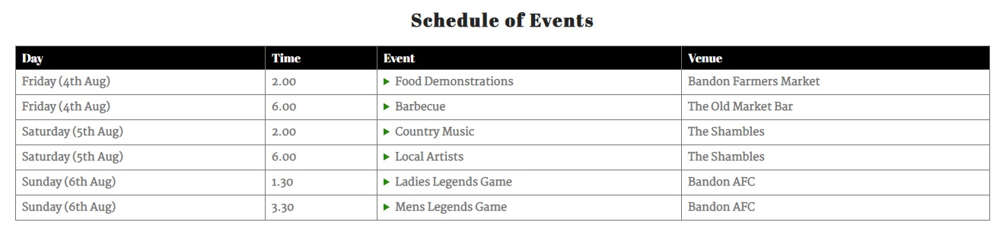

<!--- Website name -->
# Bandon Summer Festival

<!--- Website overview -->
This is the first year that the fictional Bandon Summer Festival is taking place and the Bandon Business Association committee, who are organising the festival, has decided that they want to have an online presence. The website will provide the users of the site with information about what events are taking place during the three day festival, at what time they are on and where they are taking place. A handy map of Bandon is provided. The site also outlines information about who is sponsoring the festival and allows users to give feedback to the committee about any topic they wish to raise.  

<!--- Responsive design image -->

    

<!--- Outline the features of the website -->
# Features

Both the header and the footer of the website are consistent across each of the pages. The navigation menu items also appear at the top of each page for ease of navigation. The header tells us what the name of the festival is and clearly outlines the dates the festival takes place on. The document title which appears in the tab heading also states the same details. 

<!--- Header image -->
- __Header__

  

The page footer provides links to the social media sites of the Bandon Business Association and links to the sponsors of the festival. 

<!--- Footer image -->
- __Footer__

  

<!--- Outline what each of the pages does -->
# Pages

The home page provides some information about the festival and who is organising it.

<!--- Home page image -->
- Home

  

The events page provides information about the events taking place at the festival.

<!--- Events page image -->
- Events

  

<!--- Events more info image -->
    - By clicking on an event more information is provided:

  

The map page provides a map of Bandon town.

<!--- Map page image -->
- Map

  

<!--- Future reference -->
    - The map that is provided is just a screenshot of a map of Bandon town, it is not an interactive map and does not allow the user to click on it. For future reference, this map should be fully interactive and display each of the event venues.

The feedback page provides a facility to give feedback about the festival.

<!--- Feedback page image -->
- Feedback

  

<!--- Future reference -->
    - This feedback form provided is just an example of how a user can provide feedback to the organisers of the festival. When the submit button is clicked the feedback is not saved to a database. For future reference, this feedback should be saved to a back-end database.

### Features Left to Implement

<!--- Future reference -->
- This is a fictional summer festival, if this was a website for a live festival event, a separate page would be provided giving more details about each of the festival events.

<!--- Outline my testing -->
# Testing

- I tested that my website works in different browsers: Google Chrome, Microsoft Edge and Mozilla Firefox, see below. I had to make some adjustments to my screen widths after this testing was completed.

<!--- Google Chrome, Microsoft Edge and Mozilla Firefox screenshots -->
Google Chrome

    

Microsoft Edge

    

Mozilla Firefox

  

- I tested and confirmed that my website is responsive on different screen sizes using Chrome DevTools. I designed my website on a Laptop, therefore I did a lot of testing on smaller screens. When I tested it on a Desktop screen I had to make some adjustments to my section heights to make sure it works okay on larger screens. I also tested the website on my mobile phone, see below.

Samsung Galaxy A22 5G

  

- I tested and confirmed that my navigation menu, home, events, map and feedback pages are all readable and have a good contrast between the background and foreground colours. I adjusted the colour of my page footer to resemble the page header for consistency purposes using image color picker. I also used two main fonts: one primary, Abril Fatface and one secondary, Martel. I discovered this font pairing on fontjoy.com.    

- I confirmed that my feedback form works, data must be entered in every field and a valid email address must be entered in the email field. The submit button blanks out the fields when clicked once valid data has been entered in every field. As I mentioned earlier, for future reference, this feedback data should be saved to a back-end database.

<!--- Outline the validator testing done -->
__Validator Testing__

- HTML
  - No errors were returned (I did get two warnings) when passing index.html through the official [(W3C) validator](https://validator.w3.org/nu/?doc=https%3A%2F%2Fkevjord76.github.io%2Fmilestone-project-1%2Findex.html)
  - No errors were returned (I did get one warning) when passing events.html through the official [(W3C) validator](https://validator.w3.org/nu/?doc=https%3A%2F%2Fkevjord76.github.io%2Fmilestone-project-1%2Fevents.html)
  - No errors or warnings were returned when passing map.html through the official [(W3C) validator](https://validator.w3.org/nu/?doc=https%3A%2F%2Fkevjord76.github.io%2Fmilestone-project-1%2Fmap.html)
  - No errors or warnings were returned when passing feedback.html through the official [(W3C) validator](https://validator.w3.org/nu/?doc=https%3A%2F%2Fkevjord76.github.io%2Fmilestone-project-1%2Ffeedback.html)
- CSS
  - No errors or warnings were returned when passing style.css through the official [(Jigsaw) validator](https://jigsaw.w3.org/css-validator/validator?uri=https%3A%2F%2Fkevjord76.github.io%2Fmilestone-project-1%2Fassets%2Fcss%2Fstyle.css&profile=css3svg&usermedium=all&warning=1&vextwarning=&lang=en) 

- Accessibility
  - I confirmed that the colours and fonts chosen are easy to read and accessible by running it through lighthouse in Chrome DevTools

  

  

    
<!--- Outline the bugs found -->
__Fixed Bugs__

- When I deployed my website in Github the background images did not display in the browser. The reason for this was that I was using absolute rather than relative file paths to the images. Once I set the paths to relative paths, the background images displayed.

- The biggest issue/problem that I encountered was to make sure that my screen/section heights and widths worked correctly on the different screen sizes. I had to make adjustments to these settings to get my responsive design to work correctly.

- I was getting a validation error on my style.css file when I was testing it on Jigsaw validator in relation to my import font line of code. I had to add a plus sign instead of a space to the primary font name that I was importing which solved my problem.

## Deployment

- The site was deployed to GitHub pages. The steps to deploy are as follows: 
  - In the GitHub repository, navigate to the Settings tab 
  - From the source section drop-down menu, select the Master/Main Branch
  - Once the master/main branch has been selected, the page will be automatically refreshed with a detailed ribbon display to indicate the successful deployment, see below. 

    

The live link can be found here - https://kevjord76.github.io/milestone-project-1/index.html 

- In Github you can also [Clone](https://docs.github.com/en/repositories/creating-and-managing-repositories/cloning-a-repository) or [Fork](https://docs.github.com/en/get-started/quickstart/fork-a-repo) your repository

## Credits 

I would like to say thanks to Chris Quinn, who was my mentor for this project. He was very helpful and gave me a lot of encouragement when things were not going well for me.

### Content 

- The code and ideas to make the social media links and set-up the feedback form were taken from Code Institute's Love Running walkthrough project and modified to suit the needs of this website [Love Running](https://code-institute-org.github.io/love-running-2.0/index.html)
- The icons in the footer were taken from [Font Awesome](https://fontawesome.com/)
- The font pairing that I used for my primary and secondary fonts throughout the website were discovered on [Font Joy](https://fontjoy.com/)
- The colour I used for my footer to match my header background image was designed on [Image Color Picker](https://imagecolorpicker.com/)

### Media

- The logos for Bandon Business Association and the sponsors of the festival were taken from [Bandon Business Association](https://www.bandonbusiness.com/)  
- The images used for the background pictures on my website were taken from [Pexels](https://www.pexels.com/)