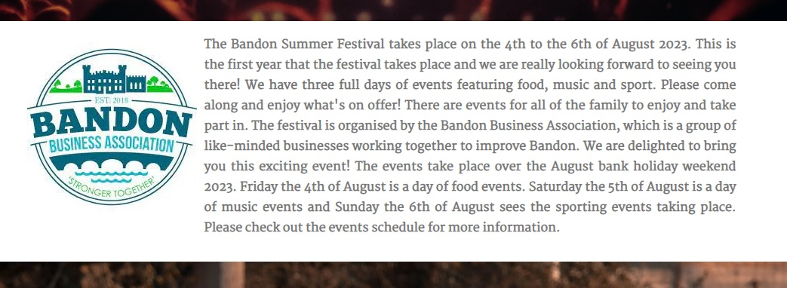

<!--- Website name -->
# Bandon Summer Festival

<!--- Website overview -->
This is the first year that the fictional Bandon Summer Festival is taking place and the Bandon Business Association committee, who are organising the festival, has decided that they want to have an online presence. The website will provide the users of the site with information about what events are taking place during the three day festival, at what time they are on and where they are taking place. A handy map of Bandon is provided. The site also outlines information about who is sponsoring the festival and allows users to give feedback to the committee about any topic they wish to raise.  

<!--- Responsive design images -->
- __Responsive Design__

  
  

<!--- Outline the features of the website -->
# Features

Both the header and the footer of the website are consistent across each of the pages. The navigation menu items also appear at the top of each page for ease of navigation. The header tells us what the name of the festival is and clearly outlines the dates the festival takes place on. The document title which appears in the tab heading also states the same details. 

<!--- Header image -->
- __Header__

  

The page footer provides links to the social media sites of the Bandon Business Association and links to the sponsors of the festival. 

<!--- Footer image -->
- __Footer__

  

<!--- Outline what each of the pages does -->
# Pages

The home page provides some information about the festival and who is organising it.

<!--- Home page image -->
- Home

  

The events page provides information about the events taking place at the festival.

<!--- Events page image -->
- Events

  

<!--- Events more info image -->
    - By clicking on an event more information is provided:

  

The map page provides a map of Bandon town.

<!--- Map page image -->
- Map

  

<!--- Future reference -->
    - The map that is provided is just a screenshot of a map of Bandon town, it is not an interactive map and does not allow the user to click on it. For future reference, this map should be fully interactive and display each of the event venues.

The feedback page provides a facility to give feedback about the festival.

<!--- Feedback page image -->
- Feedback

  

<!--- Future reference -->
    - This feedback form provided is just an example of how a user can provide feedback to the organisers of the festival. When the submit button is clicked the feedback is not saved to a database. For future reference, this feedback should be saved to a back-end database.

### Features Left to Implement

<!--- Future reference -->
- This is a fictional summer festival, if this was a website for a live festival event, a separate page would be provided giving more details about each of the festival events.

<!--- Outline my testing -->
# Testing

- I tested that my website works in different browsers: Google Chrome, Microsoft Edge and Mozilla Firefox. I had to make some adjustments to my screen widths after this testing was completed.

- I tested and confirmed that my website is responsive on different screen sizes using Chrome DevTools. I designed my website on a Laptop, therefore I did a lot of testing on smaller screens. When I tested it on a Desktop screen I had to make some adjustments to my section heights to make sure it works okay on larger screens.

- I tested and confirmed that my navigation menu, home, events, map and feedback pages are all readable and have a good contrast between the background and foreground colours. I adjusted the colour of my page footer to resemble the page header for consistency purposes using image color picker. I also used two main fonts: one primary, Abril Fatface and one secondary, Martel. I discovered this font pairing on fontjoy.com.    

- I confirmed that my feedback form works, data must be entered in every field and a valid email address must be entered in the email field. The submit button blanks out the fields when clicked once valid data has been entered in every field. As I mentioned earlier, for future reference, this feedback data should be saved to a back-end database.

<!--- Outline the bugs found -->
## Bugs

- When I deployed my website in Github the background images did not display in the browser. The reason for this was that I was using absolute rather than relative file paths to the images. Once I set the paths to relative paths, the background images displayed.

- The biggest issue/problem that I encountered was to make sure that my screen/section heights and widths worked correctly on the different screen sizes. I had to make adjustments to these settings to get my responsive design to work correctly.

The live link can be found here - https://kevjord76.github.io/milestone-project-1/index.html 